# Homeopathic Doctor Management System

A Django-based clinic management system for managing a homeopathic doctor chamber. The system handles patient registration, appointment booking, visit records, prescriptions, medicine management, fee collection, and compounder medicine preparation workflow.

---

## Project Overview

This project is designed for a small doctor chamber where different staff members have different responsibilities.

The system supports three main user roles:

- Doctor
- Receptionist
- Compounder

Each user role has a separate workflow and limited access according to their responsibility.

---

## Key Features

### Public Landing Page

- Public home page with doctor/clinic image
- Login option for staff
- Doctor name/brand can redirect to landing page

### Authentication

- User login
- User logout
- Role-based dashboard redirection
- Role-based navbar display

### Patient Management

- Register patient
- Search patient by name, phone, or patient ID
- View patient details
- Doctor can edit patient information
- Doctor can view patient visit and medicine history
- Receptionist and compounder can view patient details but cannot see medical history

### Appointment Management

- Book appointment from patient search or patient details page
- Auto daily serial number generation
- Serial number starts from 1 every new day
- Appointment status:
  - Pending
  - In Visit
  - Completed
  - Cancelled
- Old pending appointments automatically become Cancelled after date passes
- Today appointment list with serial, patient, phone, time, and status

### Visit Management

- Doctor starts visit from appointment
- Appointment status changes from Pending to In Visit
- Doctor adds symptoms and notes
- After visit submission, prescription page opens

### Prescription System

- One visit has one prescription
- One prescription can contain multiple medicine items
- Medicine can be selected from existing medicine list
- Custom medicine can be added if medicine is not available in list
- AJAX medicine search is used
- Prescription item includes:
  - Medicine
  - Potency
  - Dosage
  - Duration
  - Instruction

### Medicine Management

- Add medicine
- Search medicine
- Edit medicine
- Medicine active/inactive status
- Doctor manages medicine list
- Custom/not-in-list medicine is tracked separately

### Fee Management

- Doctor assigns fee after prescription
- Fee is linked with patient, visit, appointment, and prescription
- 0 Tk prescription count is tracked
- Compounder receives payment after medicine preparation

### Compounder Workflow

- Compounder dashboard shows medicine preparation queue
- Compounder can view prescription details
- Compounder can see:
  - Patient name
  - Fee
  - Medicine name
  - Potency
  - Dosage
  - Duration
  - Instruction
- After medicine preparation and cash received, compounder marks as Completed
- Appointment status becomes Completed
- Compounder dashboard shows:
  - Pending medicine queue
  - Completed today
  - Today cash collection

### Doctor Dashboard

Doctor dashboard includes:

- Total patients
- Today appointments
- Pending appointments
- In Visit appointments
- Completed appointments
- Cancelled appointments
- Today earning
- Lifetime earning
- Date-wise earning
- Date-wise medicine count
- Date-wise 0 Tk prescription count
- Today total medicine given
- Today not-in-list medicine count
- Today appointment list

### Receptionist Dashboard

Receptionist dashboard includes:

- Register patient button
- Book appointment button
- Today appointment serial list
- Appointment status summary

Receptionist can:

- Register patient
- Search patient
- Book appointment
- View today appointment serial list

Receptionist cannot:

- View all patient list
- Edit patient
- Start visit
- Write prescription
- Assign fee
- Manage medicine
- View patient medical history

---

## User Role Permissions

| Feature | Doctor | Receptionist | Compounder |
|---|---|---|---|
| Login | Yes | Yes | Yes |
| Patient Register | Yes | Yes | Optional |
| Patient Search | Yes | Yes | Yes |
| Patient Details | Yes | Yes | Yes |
| Patient Medical History | Yes | No | No |
| Patient Edit | Yes | No | No |
| Patient List | Yes | No | No |
| Book Appointment | Yes | Yes | Yes |
| Appointment List | Yes | Yes | Yes |
| Start Visit | Yes | No | No |
| Write Prescription | Yes | No | No |
| Assign Fee | Yes | No | No |
| Medicine CRUD | Yes | No | No |
| Compounder Queue | No | No | Yes |
| Complete Medicine Preparation | No | No | Yes |
| Doctor Dashboard | Yes | No | No |
| Receptionist Dashboard | No | Yes | No |
| Compounder Dashboard | No | No | Yes |

---

## Technology Stack

- Python
- Django
- SQLite
- HTML
- Bootstrap 5
- JavaScript
- AJAX

---

## Project Structure

```text
homeopathic_doctor_management_system/
│
├── core/
│   ├── migrations/
│   ├── templates/
│   │   └── core/
│   │       ├── appointment_form.html
│   │       ├── appointment_list.html
│   │       ├── compounder_dashboard.html
│   │       ├── compounder_prescription_detail.html
│   │       ├── create_and_edit_medicine.html
│   │       ├── create_and_edit_patient.html
│   │       ├── doctor_dashboard.html
│   │       ├── fee_form.html
│   │       ├── medicine_details.html
│   │       ├── medicine_list.html
│   │       ├── medicine_search.html
│   │       ├── patient_details.html
│   │       ├── patient_list.html
│   │       ├── patient_search.html
│   │       ├── prescription_form.html
│   │       ├── receptionist_dashboard.html
│   │       └── visit_form.html
│   │
│   ├── admin.py
│   ├── apps.py
│   ├── forms.py
│   ├── models.py
│   ├── urls.py
│   └── views.py
│
├── users/
│   ├── migrations/
│   ├── templates/
│   │   └── users/
│   │       ├── home.html
│   │       └── users_auth_form.html
│   │
│   ├── admin.py
│   ├── apps.py
│   ├── forms.py
│   ├── models.py
│   ├── urls.py
│   └── views.py
│
├── homeopathic/
│   ├── settings.py
│   ├── urls.py
│   ├── asgi.py
│   └── wsgi.py
│
├── static/
├── templates/
│   └── base.html
│
├── screenshots/
├── manage.py
├── db.sqlite3
├── .gitignore
└── README.md
```

---

## Installation and Setup

### 1. Clone the Repository

```bash
git clone https://github.com/your-username/homeopathic_doctor_management_system.git
cd homeopathic_doctor_management_system
```

### 2. Create Virtual Environment

```bash
python -m venv venv
```

### 3. Activate Virtual Environment

For Windows PowerShell:

```bash
venv\Scripts\activate
```

For Git Bash/Linux/Mac:

```bash
source venv/bin/activate
```

### 4. Install Dependencies

```bash
pip install -r requirements.txt
```

If `requirements.txt` is not created yet:

```bash
pip freeze > requirements.txt
```

### 5. Run Migrations

```bash
python manage.py makemigrations
python manage.py migrate
```

### 6. Create Superuser

```bash
python manage.py createsuperuser
```

### 7. Run Server

```bash
python manage.py runserver
```

Open in browser:

```text
http://127.0.0.1:8000/
```

---

## Important Role Values

The system checks user roles using lowercase values.

Use these role values:

```text
doctor
receptionist
compounder
```

If role values are saved as `Doctor`, `Receptionist`, or `Compounder`, update template and view conditions accordingly.

---

## Main Workflow

### Patient and Appointment Flow

```text
Patient Search
↓
Patient Details
↓
Book Appointment
↓
Daily Serial Auto Generate
↓
Appointment Status = Pending
```

### Doctor Flow

```text
Doctor Dashboard
↓
Today Appointment List
↓
View Patient
↓
Start Visit
↓
Add Symptoms and Notes
↓
Write Prescription
↓
Assign Fee
↓
Return to Doctor Dashboard
```

### Compounder Flow

```text
Compounder Dashboard
↓
Medicine Preparation Queue
↓
View Prescription Detail
↓
Prepare Medicine
↓
Receive Cash
↓
Mark Completed
↓
Appointment Status = Completed
```

### Receptionist Flow

```text
Receptionist Dashboard
↓
Register Patient
or
Search Patient
↓
Book Appointment
↓
View Today Serial List
```

---

## Database Models Overview

### User

Stores authentication and role information.

Roles:

```text
doctor
receptionist
compounder
```

### Patient

Stores patient information:

- Name
- Age
- Gender
- Phone
- Address
- Created by
- Created date

### Appointment

Stores appointment information:

- Patient
- Appointment date
- Serial number
- Status
- Created by

Appointment serial resets every day.

### Visit

Stores doctor visit information:

- Patient
- Appointment
- Symptoms
- Notes
- Created by

### Medicine

Stores medicine master list:

- Medicine name
- Description
- Active status

### Prescription

Stores prescription header:

- Visit
- Patient
- Appointment
- Created by

### PrescriptionItem

Stores prescription medicine items:

- Prescription
- Medicine from list
- Custom medicine name
- Potency
- Dosage
- Duration
- Instruction

### Fee

Stores fee and payment information:

- Prescription
- Visit
- Patient
- Appointment
- Amount
- Note
- Is paid
- Paid at
- Collected by

---

## Screenshot Section

Create a folder named:

```text
screenshots/
```

Add these screenshots:

### 1. Landing Page

File name:

```text
screenshots/landing-page.png
```

Add:

```markdown
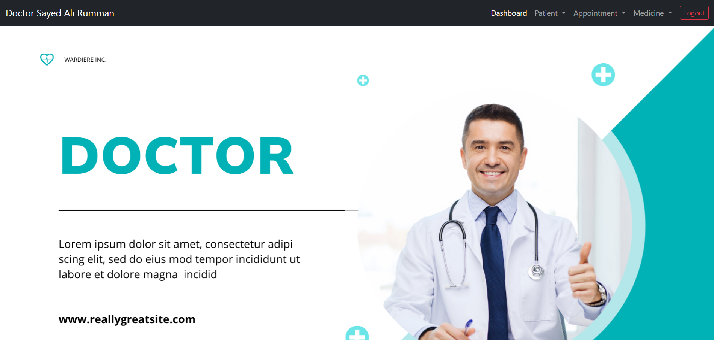
```

Capture:
- Public doctor image page
- Login button visible

### 2. Login Page

File name:

```text
screenshots/login-page.png
```

Add:

```markdown
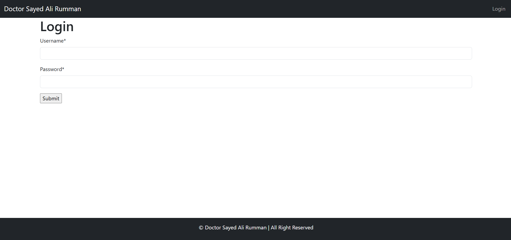
```

Capture:
- Username field
- Password field
- Submit button

### 3. Doctor Dashboard

File name:

```text
screenshots/doctor-dashboard.png
```

Add:

```markdown
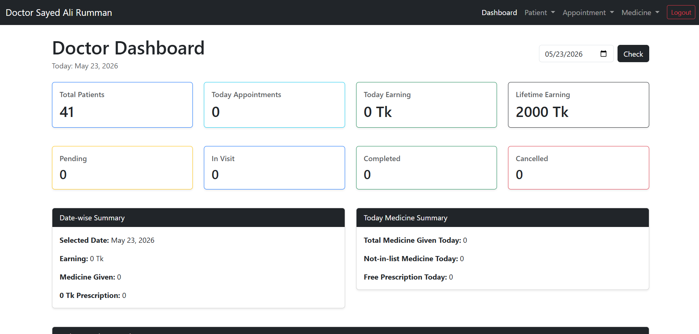
```

Capture:
- Total patients
- Today appointments
- Today earning
- Lifetime earning
- Date-wise summary
- Appointment list

### 4. Receptionist Dashboard

File name:

```text
screenshots/receptionist-dashboard.png
```

Add:

```markdown
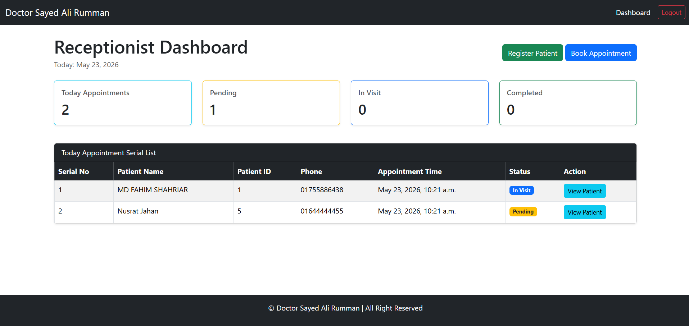
```

Capture:
- Register Patient button
- Book Appointment button
- Today appointment serial list

### 5. Compounder Dashboard

File name:

```text
screenshots/compounder-dashboard.png
```

Add:

```markdown
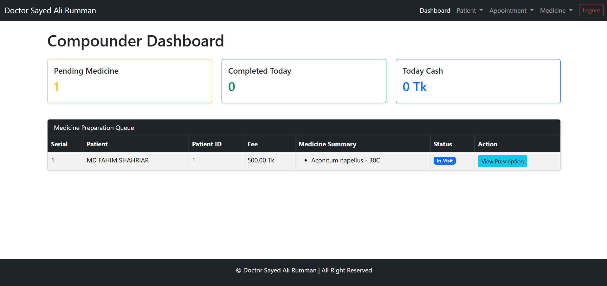
```

Capture:
- Pending medicine queue
- Completed today
- Today cash
- Prescription view button

### 6. Patient Search

File name:

```text
screenshots/patient-search.png
```

Add:

```markdown
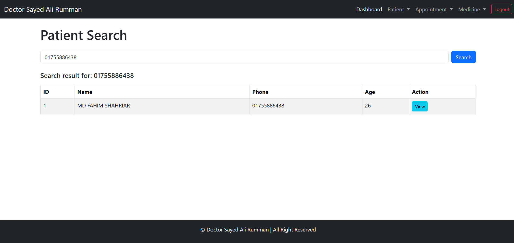
```

Capture:
- Search bar
- Search result
- View patient button
- Book appointment button

### 7. Patient Details with History

File name:

```text
screenshots/patient-details-history.png
```

Add:

```markdown
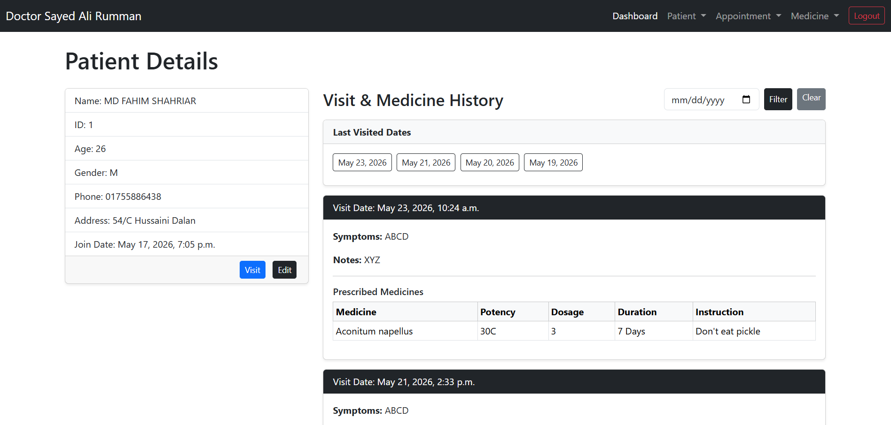
```

Capture using Doctor account:
- Patient basic information
- Visit button
- Edit button
- Last visited dates
- Symptoms history
- Medicine history

### 8. Appointment List

File name:

```text
screenshots/appointment-list.png
```

Add:

```markdown
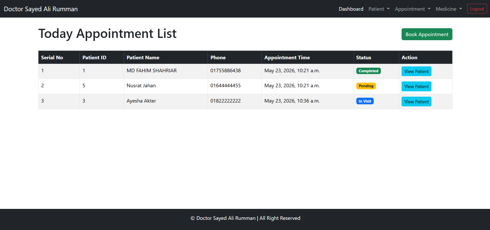
```

Capture:
- Serial number
- Patient name
- Phone
- Appointment time
- Status
- Action button

### 9. Visit Form

File name:

```text
screenshots/visit-form.png
```

Add:

```markdown
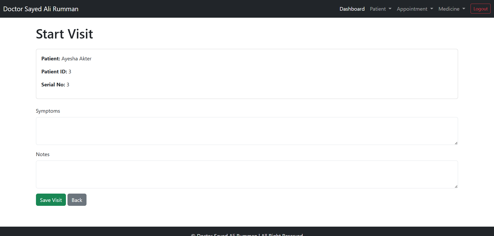
```

Capture:
- Patient information
- Symptoms field
- Notes field
- Save Visit button

### 10. Prescription Form

File name:

```text
screenshots/prescription-form.png
```

Add:

```markdown
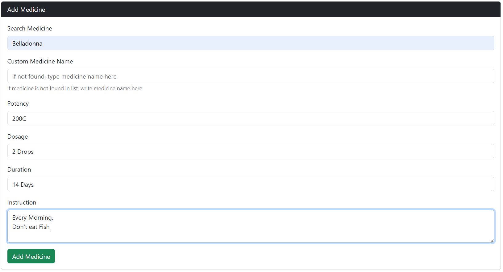
```

Capture:
- Medicine search field
- Custom medicine field
- Potency
- Dosage
- Duration
- Instruction
- Added medicine list

### 11. Fee Form

File name:

```text
screenshots/fee-form.png
```

Add:

```markdown
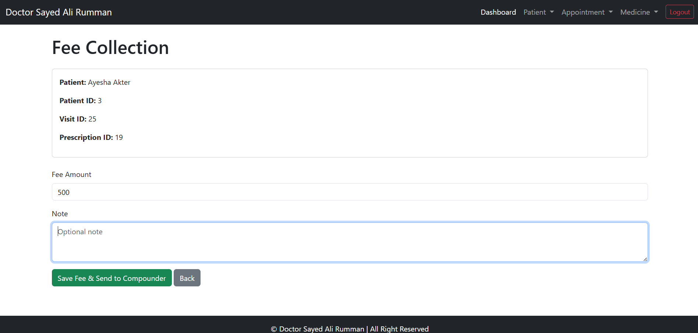
```

Capture:
- Patient details
- Prescription ID
- Fee amount
- Fee note
- Save Fee button

### 12. Compounder Prescription Detail

File name:

```text
screenshots/compounder-prescription-detail.png
```

Add:

```markdown
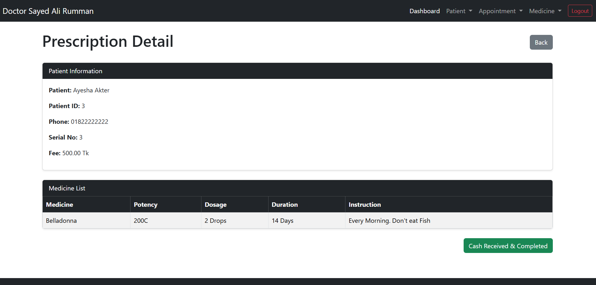
```

Capture:
- Patient name
- Fee
- Medicine list
- Dosage
- Instruction
- Cash Received & Completed button

### 13. Medicine List

File name:

```text
screenshots/medicine-list.png
```

Add:

```markdown
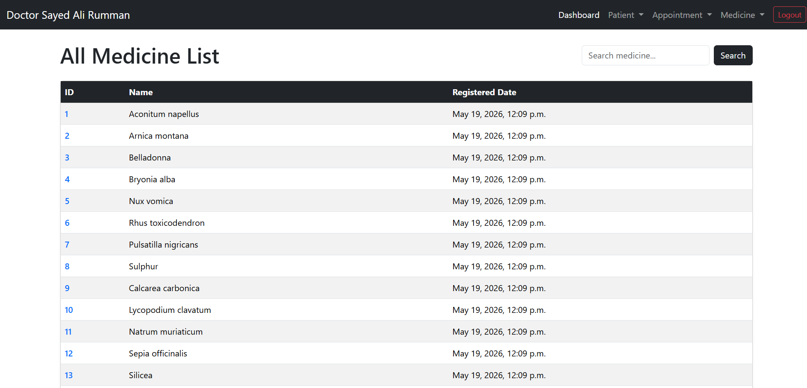
```

Capture:
- Medicine search
- Medicine names
- Edit/delete options

---

## Screenshots

After adding screenshots, use this section:

```markdown
### Landing Page


### Login Page


### Doctor Dashboard


### Receptionist Dashboard


### Compounder Dashboard


### Patient Search


### Patient Details with Medical History


### Appointment List


### Visit Form


### Prescription Form


### Fee Form


### Compounder Prescription Detail


### Medicine List

```

---

## Git Ignore

Use this `.gitignore`:

```gitignore
venv/
__pycache__/
*.pyc
*.pyo
*.pyd

db.sqlite3
*.sqlite3

.env
```

If ignored files were already committed:

```bash
git rm -r --cached venv
git rm -r --cached core/__pycache__
git rm -r --cached users/__pycache__
git rm --cached db.sqlite3
git add .gitignore
git commit -m "Remove ignored files from repository"
git push
```

---

## Future Improvements

- Stronger role-based view protection
- Medicine stock quantity
- Medicine purchase and supplier module
- Prescription print option
- Invoice print option
- Patient report PDF
- Monthly earning report
- Appointment date filter
- Advanced dashboard charts
- Password reset
- Deployment setup

---

## Developer Note

This project is created for learning and real clinic workflow practice. It uses Django, Bootstrap, SQLite, AJAX, and role-based logic to manage a homeopathic doctor chamber.

The project is still under active development.